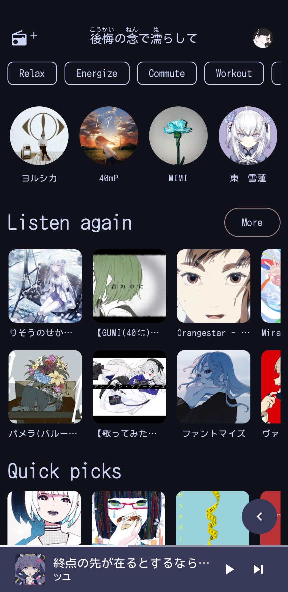
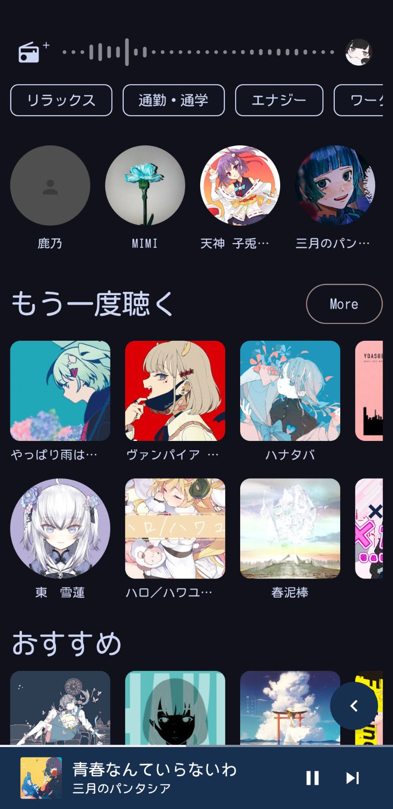
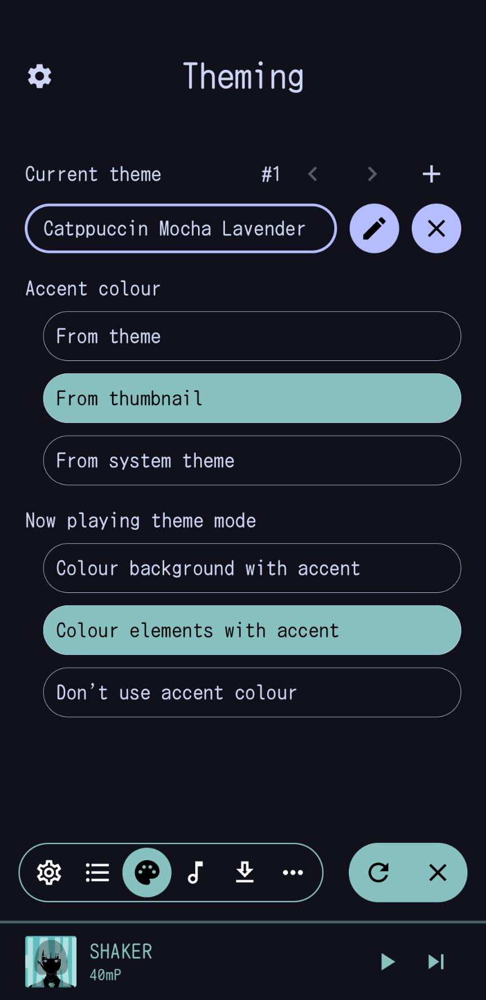
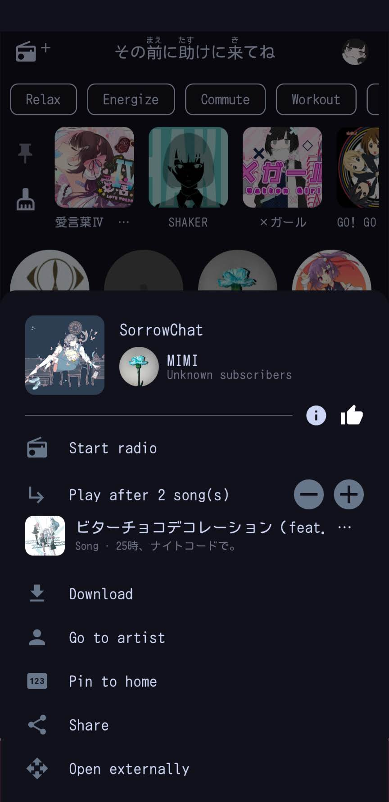
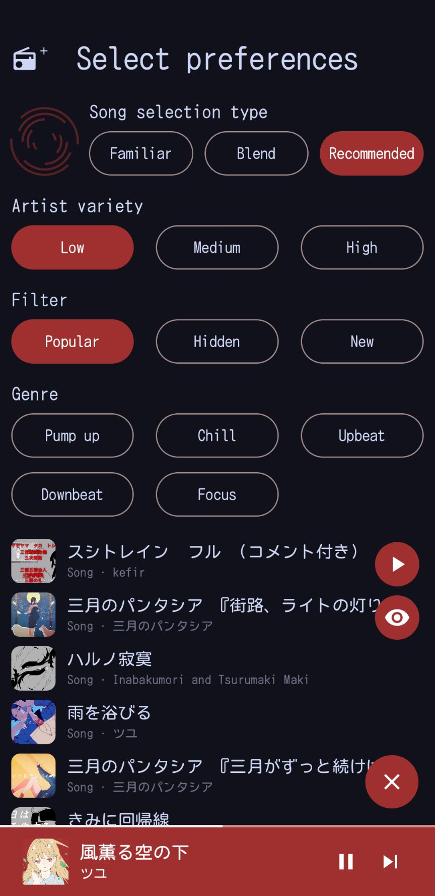
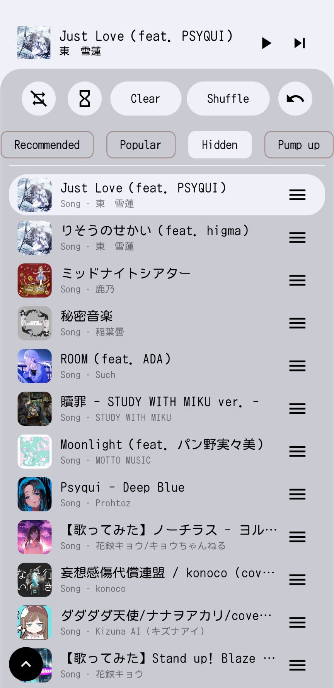
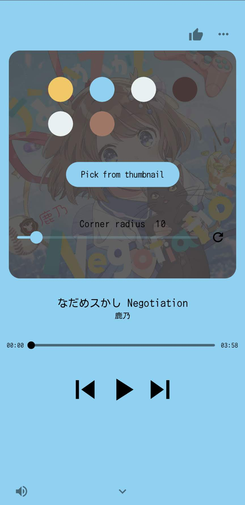

###

# SpMp
A YouTube Music client with a focus on language and metadata customisation, built primarily for Android using Jetpack Compose and Kotlin.

 

## Development status
SpMp is partially functional (I've already replaced YouTube Music with it), but many bugs remain and performance can be poor.

Support for Compose Multiplatform on desktop is [in-progress](https://github.com/toasterofbread/spmp-server) but will not be a priority until the main project is stable.

 

## Features

#### Metadata
- Edit song, artist, and playlist titles
- Set UI and metadata languages separately (ex. display the app's UI in English and show songs and artists in Japanese)
- Option to log into your YouTube Music account for displaying your personal feed, as well as interactions like liking songs and subscribing to artists

#### Lyrics
- Fetch and display lyrics from [PetitLyrics](https://petitlyrics.com/), with timed lyrics support (in-progress)
- Display timed lyrics above the home feed
- Show furigana for Japanese kanji within lyrics using [Kuromoji](https://github.com/atilika/kuromoji)

#### QOL
- Undo queue actions (no more accidental swipe removals)
- Store songs locally for offline playback
- Accessibility service for fine volume control, even when screen is off if device is rooted

#### YouTube parity
- Home feed (with filters support)
- Song radio (with filters support)
- Radio builder
- Like/dislike songs
- Subscribe/unsubscribe from artists
- Display artists and playlists (in-progress)

#### Other
- UI theme editor
- Option to automatically use a colour from the current song thumbnail as the theme accent colour
- Customisable Discord rich presence (with image support) using [KizzyRPC](https://github.com/dead8309/KizzyRPC)

And more

## Planned features
- Full offline functionality
- Use [UtaTen](https://utaten.com/) as fallback for lyrics
- Playlist editing

## Screenshots

    
-------

    

        
        
        
    

        

        
        
        
    

 

## About the project
I started this project after I got tired of dealing with YouTube's official music app's lack of language features and customisation. I tried several alternatives, but all had at least a few issues that bugged me.

So instead of spending a few weeks learning the codebase of an existing project and contributing to it, I decided to spend almost a year (as of writing) creating my own solution.

## Contributing
Pull requests and feature suggestions are welcome! This is my first Compose project so there's probably plenty of room for improvement.

## Thanks to
- [ytmusicapi](https://github.com/sigma67/ytmusicapi/): Used as a reference for the YouTube Music API
- [KeyMapper](https://github.com/keymapperorg/KeyMapper): For screen off volume control implementation
- [ExoVisualizer](https://github.com/dzolnai/ExoVisualizer): Music visualiser implementation
- [ViMusic](https://github.com/vfsfitvnm/ViMusic): A major inspiration for this project

## Disclaimer
This project and its contents are not affiliated with, funded, authorized, endorsed by, or in any way associated with YouTube, Google LLC or any of its affiliates and subsidiaries.

Any trademark, service mark, trade name, or other intellectual property rights used in this project are owned by the respective owners.
