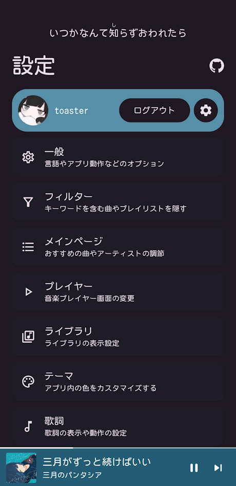
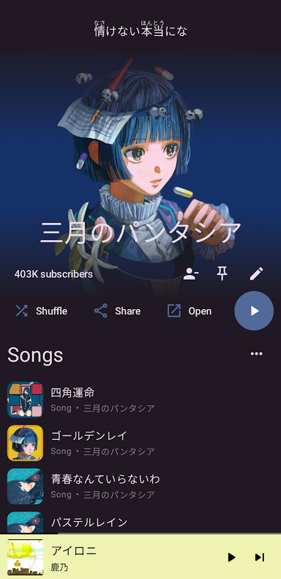
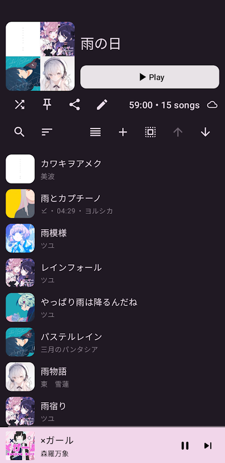

[日本語のREADMEへ](readme/README-ja.md)

###

# SpMp
A YouTube Music client with a focus on language and metadata customisation, built for Android using Jetpack Compose and Kotlin.

 

## Development status
SpMp is in alpha and still has many bugs, but is very close to being feature-complete. I've been using it instead of YouTube Music for a while now.

Support for Compose Multiplatform on desktop is [planned](https://github.com/toasterofbread/spmp-server) but will not be a priority until the main project is stable.

 

# Features
- Edit song, artist, and playlist titles
- Set separate languages for app UI and metadata like song titles
- In-app YouTube Music login
- Display time-synchronised lyrics from [PetitLyrics](https://petitlyrics.com/)
    - Timed lyrics are displayed in a toggleable bar above every app page
    - Furigana (readings) display above Japanese kanji within lyrics
- Select multiple songs for batch actions on any screen
- Pin any song, playlist, album, or artist to the top of the main page
- Customisable Discord rich presence
- Easily insert songs at any position in the queue

##### And more (see [the wiki](https://github.com/toasterofbread/spmp/wiki) for a ~~full~~ more complete list of features)

    
<h2>Screenshots</h2>

    

        
        
        
    

    
<h2>More Screenshots</h2>

    

        
        
        
    

    

        
        
        
    

 

## About the project
I started this project after I got tired of dealing with YouTube's official music app's lack of language features and customisation. I tried several alternatives, but all had at least a few issues that bugged me.

So instead of spending a few weeks learning the codebase of an existing project and contributing to it, I decided to spend almost a year (as of writing) creating my own solution.

## Contributing
Pull requests, bug reports, and feature suggestions are welcome! This is my first Compose project (and also the largest project I've ever done in general) so there's probably plenty of room for improvement.

The app is currently being developed for both English and Japanese. Contributions for other languages would be greatly appreciated! Information about app localisation can be found [here](https://github.com/toasterofbread/spmp/wiki/App-localisation).

## Also available on

## Thanks to
- [ytmusicapi](https://github.com/sigma67/ytmusicapi/): Used as a reference for the YouTube Music API
- [KeyMapper](https://github.com/keymapperorg/KeyMapper): For screen off volume control implementation
- [ExoVisualizer](https://github.com/dzolnai/ExoVisualizer): Music visualiser implementation
- [ViMusic](https://github.com/vfsfitvnm/ViMusic): A major inspiration for this project

#### Libraries (see all in [shared/build.gradle.kts](/shared/build.gradle.kts))
- [NewPipeExtractor](https://github.com/TeamNewPipe/NewPipeExtractor): Provides stream URLs for music playback
- [SQLDelight](https://github.com/cashapp/sqldelight): Database for media metadata
- [Kuromoji](https://github.com/atilika/kuromoji): Generates furigana (readings) for Japanese lyrics
- [KizzyRPC](https://github.com/dead8309/KizzyRPC) and [Kord](https://github.com/kordlib/kord): Discord status functionality and custom image support
- [ComposeReorderable](https://github.com/aclassen/ComposeReorderable): Reorderable lists like the song queue
- [compose-color-picker](https://github.com/godaddy/compose-color-picker): Theme editor colour wheel
- [Catppuccin](https://github.com/catppuccin/java): Themes included as options in-app

## Disclaimer
This project and its contents are not affiliated with, funded, authorized, endorsed by, or in any way associated with YouTube, Google LLC or any of its affiliates and subsidiaries.

Any trademark, service mark, trade name, or other intellectual property rights used in this project are owned by the respective owners.
