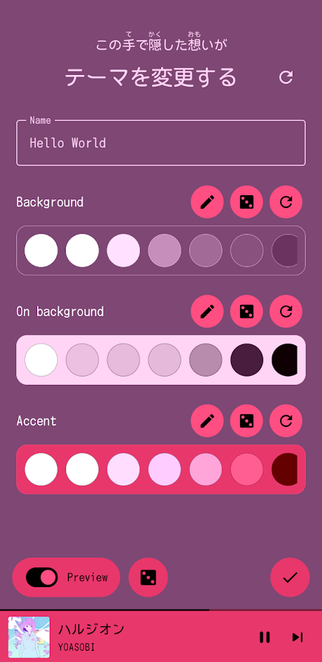

# Notice: SpMp is currently mostly non-functional

Recent YouTube API changes made audio streaming from third-party applications more difficult.

Until a fix is implemented, streaming music in SpMp usually doesn't work. The project isn't currently under active development so this might not happen for some time.

 
 
 

    <a href="readme/README-ja.md">日本語のREADMEへ</a>
    

 

###

# SpMp
A YouTube Music client with a focus on customisation of colours and song metadata, built using Compose Multiplatform for Android and desktop

 
 

# Features
- Edit song, artist, and playlist titles
- Select multiple songs for batch actions on any screen
- Customisable colour theming throughout the app
    - Use a colour from the current song's thumbnail
    - Or use a custom colour set per-song or globally
- Display app UI and metadata like song titles in separate languages
- In-app YouTube Music login
- Display time-synchronised lyrics from [KuGou](https://www.kugou.com/) and [PetitLyrics](https://petitlyrics.com/)
    - Timed lyrics are displayed in a toggleable bar above every app page
    - Furigana (readings) display above Japanese kanji within lyrics
- Pin any song, playlist, album, or artist to the top of the main page
- Customisable Discord rich presence
- Easily insert songs at any position in the queue

##### And more (see [the wiki](https://github.com/toasterofbread/spmp/wiki) for a ~~full~~ more complete list of features)

    
<h2>Screenshots</h2>

    

        
        
    

    

        
        
    

    
<h2>More Screenshots</h2>

    

        
        
        
    

    

        
        
        
    

 

## Installation

Downloads for all platforms can be found on the repository's [releases page](https://github.com/toasterofbread/spmp/releases).

#### Additional requirements on desktop

- Java must be installed for all desktop platforms
- [Several system packages](https://spmp.toastbits.dev/docs/latest/client/installation/#dependencies) are required to use the Linux version

The Android version is also available on F-Droid. There is no difference between APKs available on GitHub and those on F-Droid.

## Documentation

Documentation on advanced usage of SpMp including compilation instructions can be found at https://spmp.toastbits.dev/docs/

## About the project
I started this project after I got tired of dealing with YouTube's official music app's lack of language features and customisation. I tried several alternatives, but all had at least a few issues that bugged me.

So instead of spending a few weeks learning the codebase of an existing project and contributing to it, I decided to spend almost a year (as of writing) creating my own solution.

## Contributing
Pull requests, bug reports, and feature suggestions are welcome! This is my first Compose project (and also the largest project I've ever done in general) so there's probably plenty of room for improvement.

The app is currently being developed for both English and Japanese. Contributions for other languages would be greatly appreciated! Information about app localisation can be found [here](https://github.com/toasterofbread/spmp/wiki/App-localisation).

## Thanks to
- smlqrs: For designing the project's icon graphic
- [ytmusicapi](https://github.com/sigma67/ytmusicapi/): Used as a reference for the YouTube Music API
- [ExoVisualizer](https://github.com/dzolnai/ExoVisualizer): Music visualiser implementation
- [ViMusic](https://github.com/vfsfitvnm/ViMusic): A major inspiration for this project

#### Libraries (see all in [Dependencies.kt](/buildSrc/src/main/kotlin/plugins/spmp/Dependencies.kt))
- [Piped](https://github.com/TeamPiped/Piped): Provides stream URLs for music playback
- [SQLDelight](https://github.com/cashapp/sqldelight): Database for media metadata
- [Kuromoji](https://github.com/atilika/kuromoji): Generates furigana (readings) for Japanese lyrics
- [KizzyRPC](https://github.com/dead8309/KizzyRPC): Discord status functionality
- [ComposeReorderable](https://github.com/aclassen/ComposeReorderable): Reorderable lists like the song queue
- [compose-color-picker](https://github.com/godaddy/compose-color-picker): Theme editor colour wheel
- [Catppuccin](https://github.com/d1snin/catppuccin-kotlin): Themes included as options in-app

## Disclaimer
This project and its contents are not affiliated with, funded, authorized, endorsed by, or in any way associated with YouTube, Google LLC or any of its affiliates and subsidiaries.

Any trademark, service mark, trade name, or other intellectual property rights used in this project are owned by the respective owners.
