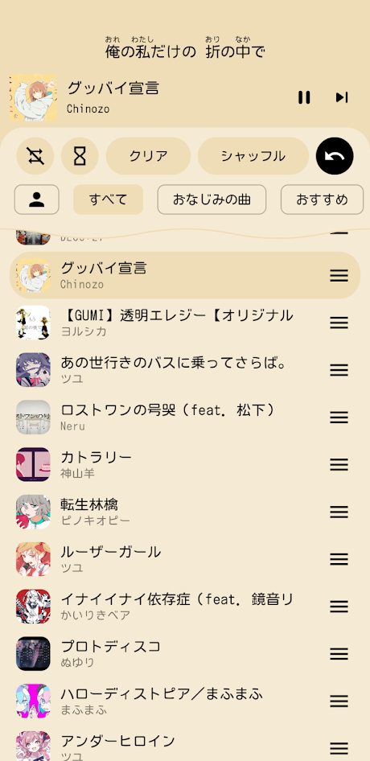
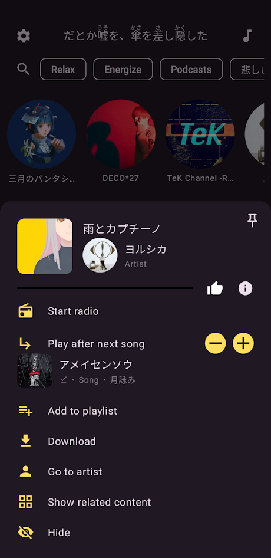

    <a href="../README.md">To the English README</a>
    

 

###

# SpMp
UIの色と曲のメタデータのカスタマイズに特化した YouTube Music のアプリ。Androidとデスクトップのプラットフォーム向けに、Compose Multiplatformを使って開発されています。

 
 

## 開発状態
SpMpのAndroid版はただいまベータテスティング中です。普段の使用には使えますが、まだ仕上げができていない部分もあります。

SpMpはデスクトップのプラットフォーム用にも[開発中](https://github.com/toasterofbread/spmp-server)ですが、まだアルファ未満の状態となっています。最低限の機能は動作していますが、テスティングはまだされていません。

 

## 機能
- 曲、アーティスト、またはプレイリストのタイトルを編集
- どの画面からでも曲を複数選択
- アプリ全体のテーマのカスタマイズが可能
    - 自動的に曲のイメージからの色を使う
    - もしくはユーザーに選択された色を使用
- UIとメタデータに別々の言語を設定
- アプリ内でYouTube Musicにログイン
- [KuGou](https://www.kugou.com/)と[プチリリ](https://petitlyrics.com/ja/)から同期可能の歌詞を表示
    - 同期可能の歌詞をアプリ内すべての画面の上に表示
    - 歌詞内の漢字の上にふりがなを表示
- 曲、アーティスト、プレイリストをメイン画面に貼り付ける
- Discordリッチプレゼンス
- 曲をキューに追加する時、簡単に位置を選択

##### 他にもあります ([wiki](https://github.com/toasterofbread/spmp/wiki) をご覧ください)

    
<h2>スクリーンショット</h2>

    

        
        
        
    

    
<h2>他のスクリーンショット</h2>

    

        
        
        
    

    

        
        
        
    

 

## このプロジェクトについて
YouTube公式のミュージックアプリをしばらく使っていましたが、言語やメタデータの設定機能の無さを感じて別のアプリをいくつか使ってみました。ましな物はあったけど、どれにも重大な問題を一つは感じました。

という訳で、数週間かけて使ってみたアプリのどれかのレポジトリーに参加するかわりに、ほぼ一年かけて自分でアプリを作ることにしました。

## コントリビュートする
Pull requestと機能の提案は歓迎です！これは僕の初めてのComposeプロジェクトで、それに今までで最大のプロジェクトなので改善の余地はたくさんあると思います。

このアプリの日本語版も英語版も開発しています。他の言語への貢献も大歓迎です！

## こちらからも入手

## 参考にしたソフト
- [ytmusicapi](https://github.com/sigma67/ytmusicapi/): YouTube Music APIの使い方の参考にさせてもらいました
- [KeyMapper](https://github.com/keymapperorg/KeyMapper): 画面オフ時の音量調整実装の参考にさせてもらいました
- [ExoVisualizer](https://github.com/dzolnai/ExoVisualizer): 音楽ビジュアライザの実装の参考にさせてもらいました
- [ViMusic](https://github.com/vfsfitvnm/ViMusic): このプロジェクトへの大きなインスピレーションでした

#### ライブラリ（すべてのライブラリを[shared/build.gradle.kts](/shared/build.gradle.kts)確認できます）
- [Piped](https://github.com/TeamPiped/Piped): 曲再生用のストリームURLを提供
- [SQLDelight](https://github.com/cashapp/sqldelight): メディアのメタデータ用データベース
- [Kuromoji](https://github.com/atilika/kuromoji): 日本語歌詞のふりがなを生成
- [KizzyRPC](https://github.com/dead8309/KizzyRPC): Discordステータス機能
- [ComposeReorderable](https://github.com/aclassen/ComposeReorderable): 曲キューなどの順序変更可能なリスト
- [compose-color-picker](https://github.com/godaddy/compose-color-picker): テーマエディター内のカラーセレクター
- [Catppuccin](https://github.com/catppuccin/java): テーマがアプリのにオプションに含まれています

## 免責事項
このプロジェクトおよびその内容は、YouTube、Google LLC、またはそれらの関連会社といかなる関連性も持っておらず、それらによって承認されたものではありません。

このプロジェクトで使用されている商標、サービスマーク、商号、その他の知的財産権は、それぞれの所有者に帰属しています。
