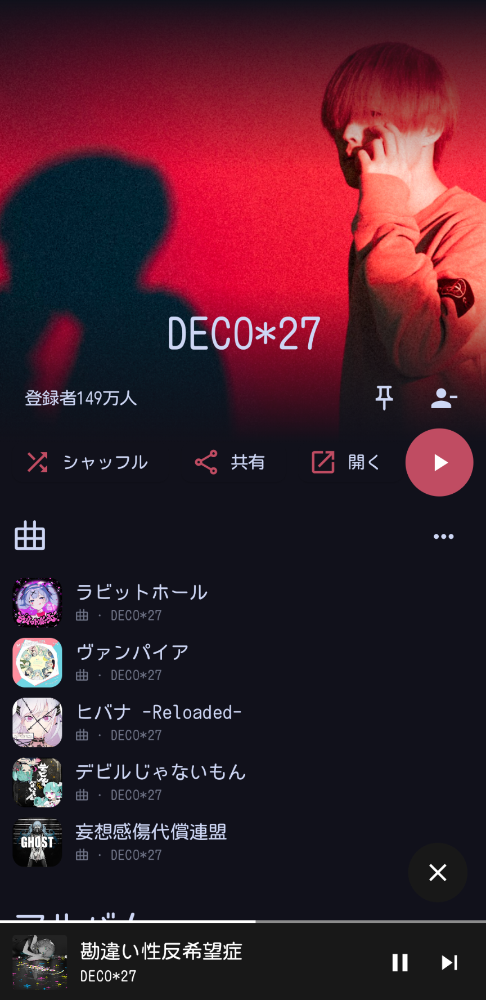
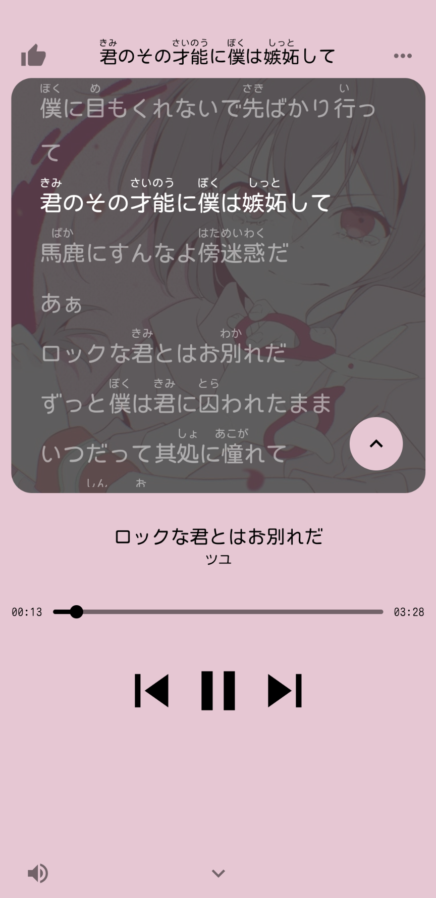
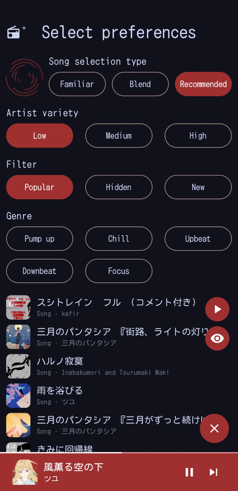
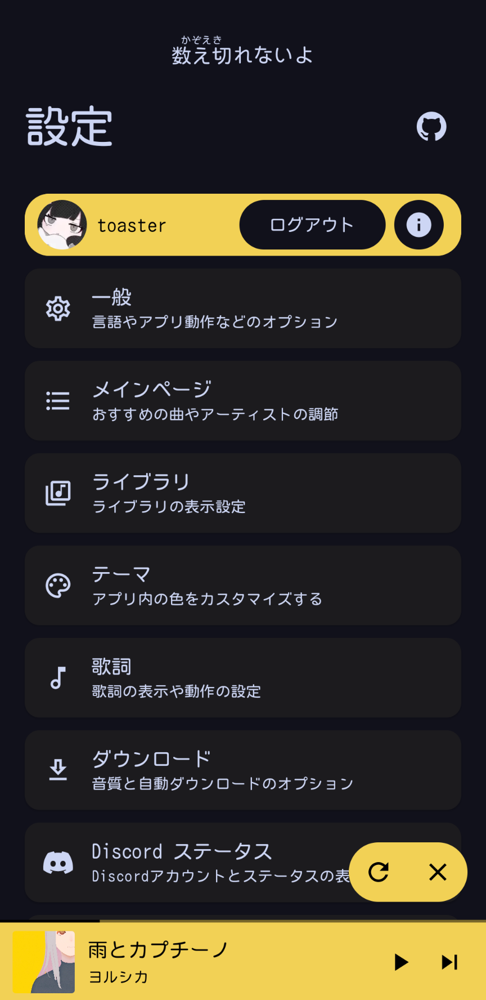

[To the English README](../README.md)

###

# SpMp
言語とメタデータのカスタマイズに特化した YouTube Music のアプリ。Jetpack ComposeとKotlinを使って主にAndroid向けに開発されています。

 

## 開発状態
SpMpはまだアルファ版であり、バグはまだ多く残っていますが、まもなく機能をすべて完成させてベータ版となる予定です。僕はすでにSpMpをYouTube Musicのかわりに使っています。

Compose Multiplatformでのデスクトップ上サポートは[計画](https://github.com/toasterofbread/spmp-server)されていますが、本プロジェクトが完成するまでは優先されません。

 

## 機能
- 曲、アーティスト、またはプレイリストのタイトルを編集
- UIとメタデータに別々の言語を設定
- アプリ内でYouTube Musicにログイン
- [プチリリ](https://petitlyrics.com/ja/)から同期可能の歌詞を表示
    - 同期可能の歌詞をアプリ内すべての画面の上に表示
    - 歌詞内の漢字の上にふりがなを表示
- どの画面からでも曲を複数選択
- 曲、アーティスト、プレイリストをメイン画面に貼り付ける
- 曲をキューに追加する時、簡単に位置を選択
- Discordリッチプレゼンス

##### 他にもあります ([wiki](https://github.com/toasterofbread/spmp/wiki) をご覧ください)

    
<h2>スクリーンショット</h2>

    

        
        
        
    

    
<h2>他のスクリーンショット</h2>

    

        
        
        
    

    

        
        
        
    

 

## このプロジェクトについて
YouTube公式のミュージックアプリをしばらく使っていましたが、言語やメタデータの設定機能の無さを感じて別のアプリをいくつか使ってみました。ましな物はあったけど、どれにも重大な問題を一つは感じました。

という訳で、数週間かけて使ってみたアプリのどれかのレポジトリーに参加するかわりに、ほぼ一年かけて自分でアプリを作ることにしました。

## コントリビュートする
Pull requestと機能の提案は歓迎です！これは僕の初めてのComposeプロジェクトで、それに今までで最大のプロジェクトなので改善の余地はたくさんあると思います。

このアプリの日本語版も英語版も開発しています。他の言語への貢献も大歓迎です！

## こちらでも入手

## 参考にしたソフト
- [ytmusicapi](https://github.com/sigma67/ytmusicapi/): YouTube Music APIの使い方の参考にさせてもらいました
- [KeyMapper](https://github.com/keymapperorg/KeyMapper): 画面オフ時の音量調整実装の参考にさせてもらいました
- [ExoVisualizer](https://github.com/dzolnai/ExoVisualizer): 音楽ビジュアライザの実装の参考にさせてもらいました
- [ViMusic](https://github.com/vfsfitvnm/ViMusic): このプロジェクトへの大きなインスピレーションでした

#### ライブラリ（すべてのライブラリを[shared/build.gradle.kts](/shared/build.gradle.kts)確認できます）
- [NewPipeExtractor](https://github.com/TeamNewPipe/NewPipeExtractor): 曲再生用のストリームURLを提供
- [SQLDelight](https://github.com/cashapp/sqldelight): メディアのメタデータ用データベース
- [Kuromoji](https://github.com/atilika/kuromoji): 日本語歌詞のふりがなを生成
- [KizzyRPC](https://github.com/dead8309/KizzyRPC) and [Kord](https://github.com/kordlib/kord): Discordステータスとその画像機能
- [ComposeReorderable](https://github.com/aclassen/ComposeReorderable): 曲キューなどの順序変更可能なリスト
- [compose-color-picker](https://github.com/godaddy/compose-color-picker): テーマエディター内のカラーセレクター
- [Catppuccin](https://github.com/catppuccin/java): テーマがアプリのにオプションに含まれています

## 免責事項
このプロジェクトおよびその内容は、YouTube、Google LLC、またはそれらの関連会社といかなる関連性も持っておらず、それらによって承認されたものではありません。

このプロジェクトで使用されている商標、サービスマーク、商号、その他の知的財産権は、それぞれの所有者に帰属しています。
